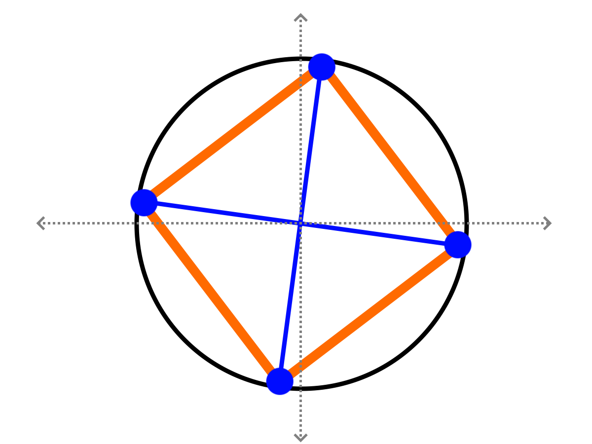

# 2D Rolling Simulation Design Description

## Purpose / Value / CONOP

### Overview
This game simulates rolling 2D dice (e.g., 4-sided square dice) with realistic physics. The dice will be "tossed" into the air and will bounce around until they settle in a static position. The final value shown on the top face of the dice will be the result.

### Objectives
1. Create an engaging and visually appealing dice rolling simulation.
2. Implement a physics engine to realistically simulate the dice movements and interactions.
3. Provide accurate and easy-to-read results after each roll.

### Key Features
1. **Dice Types**: Support for multiple dice types (e.g., 4-sided, 6-sided) with corresponding shapes (e.g., squares, hexagons).
2. **Physics Simulation**: Realistic physics to simulate tossing, bouncing, and settling of the dice.
3. **Interactive UI**: Simple and intuitive user interface for rolling dice and displaying results.
4. **Customizable Settings**: Options to select dice type, physic parameters, and other settings.

### Components
1. **User Interface (UI)**
   - Roll Button: Initiates the dice roll.
   - Dice Display: Shows the current state of the dice.
   - Result Display: Shows the final result after the dice settle.
   - Settings Menu: Allows users to customize dice type, physics parameters, and other options.
2. **Physics Engine**
   - Toss Simulation: Simulates the initial toss of the dice, including spin and velocity.
   - Collision Detection: Handles collisions between dice and with the floor/walls.
   - Settling Detection: Determines when the dice have settled in a static position.
3. **Dice Objects**
   - Dice Shapes: Represent different dice types (e.g., squares for 4-sided dice).
   - Textures: Visual representations of the dice faces with numbers.

### User Flow
1. User selects the dice type from the settings menu.
2. User clicks the roll button to initiate the dice roll.
3. The die is tossed into the air and the physics engine simulates its movements.
4. The die bounces around and eventually settles in a static position.
5. The result is displayed, showing the value on the top face of the die.

### Technical Requirements
1. **Languages**: TypeScript, HTML, CSS
2. **Libraries/Frameworks**:
   - Physics Engine: Custom
   - UI Framework: plain HTML/CSS
3. Deployment: Host on a web server for browser access.

### Conclusion
This 2D dice rolling game provides a fun and interactive way to simulate dice rolls with realistic physics. By leveraging TypeScript, HTML, and a physics engine, the game can deliver a smooth and engaging experience for players.

## Conceptual Description and Algorithm Design

### Introduction
- **Purpose**: The main CONOP for the 2D Dice Rolling Game simulation is described above.  My objective in creating this is to gain experience with the advantages of using TypeScript and to have fun implementing kinematics into a SW simulation.
- **Audience**: Myself and some of my friends.  The intention is for this to be hosted on [https://pcowhill.github.io](https://pcowhill.github.io).
- **Overview**: This game simulates rolling 2D dice (e.g., 4-sided square dice) with realistic physics. The dice will be "tossed" into the air and will bounce around until they settle in a static position. The final value shown on the top face of the dice will be the result.

### Game Overview
- **Concept**: The concept behind this simulation is comprised of a number of components which are each described in more detail in their appropriate sections following this one.
  - Dice Objects: A mathematical model will be made for the dice objects and the edges of the box.
  - Physics and Simulation Engine: A custom kinematics-based physics engine will be implemented to ensure that the behavior of the dice when starting at a random initial state will reliably behave as expected.  Collision logic will be implemented to have the dice realistically interact with the edges of the box.
  - User Interface: An intuitive user interface will be created for the user to interact with the simulation engine.

### Dice Objects
- **Shapes**: Dice can have any integer number of sides of at least 2 (so a 2-sided die -- i.e. a coin -- can be created).  All of the dice will be regular polygons.
- **Composition**: The dice will be modeled as a collection of vertices.  Since there will not exist any edge collision (as the box containing the dice is concave and the dice themselves are convex), the edges are not modeled.  The position, velocity, and acceleration of the die will be in two components: a cartesian component, and a torsional/polar component.  The position of each individual vertex will be determined from each of these.  For example, the figure below shows a representation of a 4-sided die.
  - The grey axes represent the primary coordinate system being used for tracking the relative position of dice with the edges of the box.  For the purposes of this graphic, the axes are centered on the middle of the die, but this may not be the case for every instance of this die at each time point.
  - The black circle represents a constant radius distance away from the center of the die.
  - The orange square shows how the die will be graphically displayed within the game.
  - The blue dots represent the vertices of the polygon.  The blue cross shows another skeleton-frame based representation of these vertices.

*Figure: Representation of 4-sided Die*

- **Texture**: As shown in the figure above, the dice will be represented graphically as regular polygons (such as the orange square in the above figure).
- **Properties**: Many of the properties of the dice can be explored within this simulation such as: the number of sides, the length of the side (and therefore the polygon's radius), and the color of the die.  More complex properties such as having vertices with differing masses and irregular polygons could also be explored.

### Physics and Simulation Engine
- **Time Steps**: The main simulation logic will take place within a loop.  The amount of time that has passed since the last loop commenced will be measured and will constitute the amount that the die should move and accelerate.  This should ensure that the animation looks smooth, independent of if a single frame took 0.01s to create or 0.001s to create.  There may also be a place for an FPS limiter on this depending on how the physics logic handles small values of time.
- **Force of Gravity**: Gravity will naturally be applied as a force against the die to pull it downward.
- **Collision Detection and Response**: Collision detection and response follows a few steps.
   1. Edge Collision Detection: The edges of the box will be concave and static.  For each vertex within the polygon, it can be determined if the vertex were to lie outside the bounds of the box by running a simple threashold comparison on the relevant component of its absolute cartesian position.  For example, if the right-most vertical edge of the box exists at x=200.0, then a collision would occur if the x-position of a vertex is greater than or equal to 200.0.
   2. 1-Frame Reversal Force: When a collision is detected during a frame (and multiple detections could occur in a single frame), then the vertex that caused the collision will experience a single-frame reversal force that will attempt to simulate an innelastic collision.
      1.  First, it will be determined what the velocity of the point should be after this frame.  In an inelastic collision, the component of the velocity normal to the edge of the box should be reversed and dampened by some scale factor.  For example, if the velocity going toward a vertical edge is +10.0, and the scalling factor reduced the velocity by 10%, then the new velocity should be -9.0.
      2. Then, based on the mass of the vertex and the duration of the time step, the necessary force to be applied to the vertex which would result in this new velocity being acheived in the next frame will be applied.
      3. Then, the force will be converted from a 2D cartesian vector into two components.  A cartesian component which will be applied to the center of mass of the die, and a polar component which will apply torsional force against the center of mass of the die.
      4. Then, the force will be applied to the center of mass of the die, impacting all vertices in the expected manner.
   3. Frictional Force:  When a collision occurs, an additional frictional force will be applied in the direction parallel to the edge.  This will behave in a similar manner to the 1-frame reversal force.
- **Velocity and Acceleration Tracking**: The position, velocity, and accelleration of the dice will be solely applied to and determined from the center of mass and not from the vertices themselves.
- **Settling Behavior**: To avoid "bouncing" where the die constantly dips into the bottom edge of the box (due to gravity) and then pushes back up from the 1-frame collision force, settling logic will be implemented to declare the die completely still.
  - Low-velocity collisions: If the component of the velocity normal to the edge being collided with is sufficiently small, then the collision may simply move the vertex toward the surface of the edge, and then completely negate that component of the velocty (instead of attempting to reflect it).
  - Disabling gravity: For when the center of mass of the die is sufficiently close to the bottom edge, then gravity may simply be turned off to allow the die to settle.
  - Friction: To avoid dice sliding around on the bottom of the edge of the box, frictional force will continued to be applied even if strict collision logic (as previously described) is not being used.

### User Interface
The user interface will be designed in the course of development.  It is not the focus of this exercise, and is therefore not a major enough concern at the time of writing this document.

### Implementation Plan
- **Development Phases**: The following stages will be pursued within the development of this simulation:
  - Concept: With the creation of the CONOP, the concept stage has been completed.
  - Design: With the creation of this Design Document, the design stage has been completed.
  - Prototype: A prototype version of some of the physics simulation objects will be composed to ensure they are realistic.
  - Functional: A stubb-version of the code will be writin with all major classes, attributes, and methods (but with none of the logic present).
  - Technical Implementation: Each of the functions will be implemented.
  - Validation and Testing: Necessary validation of results and automated testing will be implemented to eliminate/reduce bugs and provide a quality product.
- **Milestones**: Multiple major minimum viable product (MVP) stages will be pursed in order to make incremental progress toward the successful implementation of this simulation.  Tentatively, they are:
  - v0.1 single-point physics: in which a single vertex will be tested
  - v0.2 2-point physics: in which a "coin-like" object will be tested
  - v0.3 n-point physics: in which a true polygon will be tested
  - v0.4 graphical basics: in which intuitive graphics and UI will be designed
  - v1.0 initial release: in which the app will be released
- **Testing and Validation**: Necessary testing and validation steps will be implemented.

## Modeling Elastic Deflection

### Introductory Notes / Lessons Learned:
- Note that the type of action that occurs when a die strikes the side of the box is called a "deflection", not a "collision".  This has caused much confusion.  Elastic collisions involve conservation of momentum and energy while deflections (i.e. collisions off infinitely massive objects, such as the wall of the box) only conserve energy as the wall "sucks up" momentum while not changing its velocity.  Everywhere else in this document where the word "collision" is used, I am talking about a deflection.

### Math for Elastic Deflection
Imagine that a regular-polygonal object is traveling toward a wall (or more specifically, one vertex of the polygon in particular is about to strike a wall).  The object has mass (which gives it linear momentum and energy) and also a moment of inertia (which gives it angular momentum and energy).  The center of mass of the object has linear velocity, and since the object may or may not be spinning about its center of mass, it also has angular velocity.  Since there are no forces acting upon the object as it approaches the wall, these velocities are constant until it strikes the wall.

Once the object strikes the wall, its linear velocity and angular velocity will change.  The wall will push against the object in the direction perpendicular to the wall's surface.  Note that this is a frictionless wall, so no portion of the force applied will be in the direction parallel to the wall.  Since this is an elastic collision, it's energy will be conserved.  If it was an inelastic collision, a fixed proportion (e.g. 90%) of the energy would be conserved, and the remainder would be lost.

Our objective is to calculate what the linear velocity and angular velocity of the object is immediately following the deflection off the wall.

The variables used are:
- $v_i$ - The initial linear velocity of the object before striking the wall (known).
- $v_f$ - The final linear velocity of the object after striking the wall (unknown).
- $\omega_i$ - The initial angular velocity of the object before striking the wall (known).
- $\omega_f$ - The final angular velocity of the object after striking the wall (unknown).
- $m$ - The mass of the object (known).
- $I$ - The moment of inertia of the object (known).
- $E_i$ - The total initial energy of the system.
- $E_f$ - The total final energy of the system.
- $F$ - While not the exact force applied to the object, $F$ is proportional to the force applied to the object during the collision in the direction perpendicular to the surface of the wall.
  - Note that, in the perfect model, the force applied to the object would happen instantaneously and be infinite.
  - If instead the time of deflection is seen as some very very small amount of time, then the force applied is very large and finite.  This force is what $F$ is proportional to.  As the amount of time approaches 0 seconds, the actual force diverges and becomes infinite, but $F$ stays the same.
- $\phi$ - The angle between the surface of the wall and the vector connecting the center of mass to the vertex striking the wall.

Finding $v_f$ and $\omega_f$ will involve establishing a system of two equations and then solving for each.

The first equation comes from the conservation of energy:
$$E_i = E_f$$
$$\frac{v_i^2m}{2} + \frac{\omega_i^2I}{2}  =  \frac{v_f^2m}{2} + \frac{\omega_f^2I}{2}$$

The second equation comes from the coupled relationship between how the force applied to the object upon striking the wall changes the linear velocity and angular velocity.  The force applies an instantaneous accelleration to the object which is proportional to a difference in velocity (in the same way that $F$ is proportional to the force).
- 100% of the force directly affects the linear velocity.
- A smaller proportion of the force acts as a torque and affects the angular velocity.  This torque depends upon the angle between the angle between the surface of the wall and the vector connecting the center of mass to the vertex striking the wall.
$$F = m(v_f-v_i)$$
$$F\cos{\phi} = I(\omega_f-\omega_i)$$

Combining the force equations produces:
$$m(v_f-v_i)\cos{\phi} = I(\omega_f-\omega_i)$$

Together, the energy conservation and coupled force equations produce a system of equations which can be used to solve for the unknown variables $v_f$ and $\omega_f$.
$$\frac{v_i^2m}{2} + \frac{\omega_i^2I}{2}  =  \frac{v_f^2m}{2} + \frac{\omega_f^2I}{2}$$
$$m(v_f-v_i)\cos{\phi} = I(\omega_f-\omega_i)$$

First, solve for $v_f$ in the force equation:
$$m(v_f-v_i)\cos{\phi} = I(\omega_f-\omega_i)$$
$$v_f-v_i = \frac{I(\omega_f-\omega_i)}{m\cos{\phi}}$$
$$v_f = v_i + \frac{I(\omega_f-\omega_i)}{m\cos{\phi}}$$

The, plug that into the first equation:
$$\frac{v_i^2m}{2} + \frac{\omega_i^2I}{2} = \frac{v_f^2m}{2} + \frac{\omega_f^2I}{2}$$
$$\frac{v_i^2m}{2} + \frac{\omega_i^2I}{2} = \frac{(v_i + \frac{I(\omega_f-\omega_i)}{m\cos{\phi}})^2m}{2} + \frac{\omega_f^2I}{2}$$
$$v_i^2m + \omega_i^2I = (v_i + \frac{I(\omega_f-\omega_i)}{m\cos{\phi}})^2m + \omega_f^2I$$
$$v_i^2m + \omega_i^2I = mv_i^2 + m2v_i\frac{I(\omega_f-\omega_i)}{m\cos{\phi}} + m(\frac{I(\omega_f-\omega_i)}{m\cos{\phi}})^2 + \omega_f^2I$$
$$\omega_i^2I = m2v_i\frac{I(\omega_f-\omega_i)}{m\cos{\phi}} + m(\frac{I(\omega_f-\omega_i)}{m\cos{\phi}})^2 + \omega_f^2I$$
$$\omega_i^2I = 2v_i\frac{I(\omega_f-\omega_i)}{\cos{\phi}} + m\frac{I^2(\omega_f-\omega_i)^2}{m^2\cos^2{\phi}} + \omega_f^2I$$
$$\omega_i^2I = 2v_i\frac{I(\omega_f-\omega_i)}{\cos{\phi}} + m\frac{I^2(\omega_f^2-2\omega_f\omega_i+\omega_i^2)}{m^2\cos^2{\phi}} + \omega_f^2I$$
$$\omega_i^2I = \frac{2v_iI}{\cos{\phi}}\omega_f - \frac{2v_iI\omega_i}{\cos{\phi}} + m\frac{I^2(\omega_f^2-2\omega_f\omega_i+\omega_i^2)}{m^2\cos^2{\phi}} + \omega_f^2I$$
$$\omega_i^2I = \frac{2v_iI}{\cos{\phi}}\omega_f - \frac{2v_iI\omega_i}{\cos{\phi}} + \frac{I^2(\omega_f^2-2\omega_f\omega_i+\omega_i^2)}{m\cos^2{\phi}} + \omega_f^2I$$
$$\omega_i^2I = \frac{2v_iI}{\cos{\phi}}\omega_f - \frac{2v_iI\omega_i}{\cos{\phi}} + \frac{I^2}{m\cos^2{\phi}}\omega_f^2 - \frac{2I^2\omega_i}{m\cos^2{\phi}}\omega_f + \frac{I^2\omega_i^2}{m\cos^2{\phi}} + I\omega_f^2$$
$$0 = 
(- \omega_i^2I - \frac{2v_iI\omega_i}{\cos{\phi}} + \frac{I^2\omega_i^2}{m\cos^2{\phi}})
+ (\frac{2v_iI}{\cos{\phi}} - \frac{2I^2\omega_i}{m\cos^2{\phi}})\omega_f
+ (\frac{I^2}{m\cos^2{\phi}} + I)\omega_f^2$$

Now, the quadratic formula can be used to solve for $\omega_f$:
$$\omega_f = \frac{-b \pm \sqrt{b^2-4ac}}{2a}$$
$$a = \frac{I^2}{m\cos^2{\phi}} + I$$
$$b = \frac{2v_iI}{\cos{\phi}} - \frac{2I^2\omega_i}{m\cos^2{\phi}}$$
$$c = - \omega_i^2I - \frac{2v_iI\omega_i}{\cos{\phi}} + \frac{I^2\omega_i^2}{m\cos^2{\phi}}$$

Within the square root, $b^2$ is:
$$b^2 = (\frac{2v_iI}{\cos{\phi}} - \frac{2I^2\omega_i}{m\cos^2{\phi}})^2$$
$$b^2 = (\frac{2v_iI}{\cos{\phi}})^2 - 2(\frac{2v_iI}{\cos{\phi}})(\frac{2I^2\omega_i}{m\cos^2{\phi}}) + (\frac{2I^2\omega_i}{m\cos^2{\phi}})^2$$
$$b^2 = \frac{4v_i^2I^2}{\cos^2{\phi}} - \frac{8v_iI^3\omega_i}{m\cos^3{\phi}} + \frac{4I^4\omega_i^2}{m^2\cos^4{\phi}}$$

...and $-4ac$ is:
$$-4ac = -4 (\frac{I^2}{m\cos^2{\phi}} + I)(- \omega_i^2I - \frac{2v_iI\omega_i}{\cos{\phi}} + \frac{I^2\omega_i^2}{m\cos^2{\phi}})$$
$$-4ac = -4 (\frac{I^2}{m\cos^2{\phi}})(- \omega_i^2I - \frac{2v_iI\omega_i}{\cos{\phi}} + \frac{I^2\omega_i^2}{m\cos^2{\phi}}) - 4I(- \omega_i^2I - \frac{2v_iI\omega_i}{\cos{\phi}} + \frac{I^2\omega_i^2}{m\cos^2{\phi}})$$
$$-4ac = -4 (\frac{I^2}{m\cos^2{\phi}})(- \omega_i^2I - \frac{2v_iI\omega_i}{\cos{\phi}} + \frac{I^2\omega_i^2}{m\cos^2{\phi}}) + 4\omega_i^2I^2 + \frac{8v_iI^2\omega_i}{\cos{\phi}} - \frac{4I^3\omega_i^2}{m\cos^2{\phi}}$$
$$-4ac = \frac{4I^3\omega_i^2}{m\cos^2{\phi}} + \frac{8v_iI^3\omega_i}{m\cos^3{\phi}} - \frac{4I^4\omega_i^2}{m^2\cos^4{\phi}} + 4\omega_i^2I^2 + \frac{8v_iI^2\omega_i}{\cos{\phi}} - \frac{4I^3\omega_i^2}{m\cos^2{\phi}}$$
$$-4ac = \frac{8v_iI^3\omega_i}{m\cos^3{\phi}} - \frac{4I^4\omega_i^2}{m^2\cos^4{\phi}} + 4\omega_i^2I^2 + \frac{8v_iI^2\omega_i}{\cos{\phi}}$$

... so, $b^2-4ac$ is:
$$b^2-4ac = \frac{4v_i^2I^2}{\cos^2{\phi}} - \frac{8v_iI^3\omega_i}{m\cos^3{\phi}} + \frac{4I^4\omega_i^2}{m^2\cos^4{\phi}} + \frac{8v_iI^3\omega_i}{m\cos^3{\phi}} - \frac{4I^4\omega_i^2}{m^2\cos^4{\phi}} + 4\omega_i^2I^2 + \frac{8v_iI^2\omega_i}{\cos{\phi}}$$
$$b^2-4ac = \frac{4v_i^2I^2}{\cos^2{\phi}} + 4\omega_i^2I^2 + \frac{8v_iI^2\omega_i}{\cos{\phi}}$$
$$b^2-4ac = 4I^2(\frac{v_i^2}{\cos^2{\phi}} + \omega_i^2 + \frac{2v_i\omega_i}{\cos{\phi}})$$
$$b^2-4ac = 4I^2(\frac{v_i}{\cos{\phi}} + \omega_i)^2$$

... Hence, there is no imaginary component in the numerator since:
$$\sqrt{b^2-4ac} = \sqrt{4I^2(\frac{v_i}{\cos{\phi}} + \omega_i)^2}$$
$$\sqrt{b^2-4ac} = 2I(\frac{v_i}{\cos{\phi}} + \omega_i)$$

Therefore, the full numerator is:
$$-b \pm \sqrt{b^2-4ac} = -(\frac{2v_iI}{\cos{\phi}} - \frac{2I^2\omega_i}{m\cos^2{\phi}}) \pm 2I(\frac{v_i}{\cos{\phi}} + \omega_i)$$
$$-b \pm \sqrt{b^2-4ac} = -\frac{2v_iI}{\cos{\phi}} + \frac{2I^2\omega_i}{m\cos^2{\phi}} \pm \frac{2Iv_i}{\cos{\phi}} \pm 2I\omega_i$$

If the $\pm$ was $+$, then:
$$-b + \sqrt{b^2-4ac} = -\frac{2v_iI}{\cos{\phi}} + \frac{2I^2\omega_i}{m\cos^2{\phi}} + \frac{2Iv_i}{\cos{\phi}} + 2I\omega_i$$
$$-b + \sqrt{b^2-4ac} = \frac{2I^2\omega_i}{m\cos^2{\phi}} + 2I\omega_i$$

...and, so:
$$\frac{-b \pm \sqrt{b^2-4ac}}{2a} = \frac{\frac{2I^2\omega_i}{m\cos^2{\phi}} + 2I\omega_i}{2(\frac{I^2}{m\cos^2{\phi}} + I)}$$
$$\frac{-b \pm \sqrt{b^2-4ac}}{2a} = \frac{\frac{2I^2\omega_i}{m\cos^2{\phi}} + 2I\omega_i}{\frac{2I^2}{m\cos^2{\phi}} + 2I}$$
$$\frac{-b \pm \sqrt{b^2-4ac}}{2a} = \frac{\omega_i\frac{2I^2}{m\cos^2{\phi}} + 2I}{\frac{2I^2}{m\cos^2{\phi}} + 2I}$$
$$\frac{-b \pm \sqrt{b^2-4ac}}{2a} = \omega_i$$

This solution ($\omega_f=\omega_i$, and therefore $v_i=v_f$) indicates the object passed through the wall, keeping its velocities the same.  This is not the answer we are looking for.

And so, the $\pm$ is $-$, leading to:
$$-b - \sqrt{b^2-4ac} = -\frac{2v_iI}{\cos{\phi}} + \frac{2I^2\omega_i}{m\cos^2{\phi}} - \frac{2Iv_i}{\cos{\phi}} - 2I\omega_i$$
$$-b - \sqrt{b^2-4ac} = -\frac{4v_iI}{\cos{\phi}} + \frac{2I^2\omega_i}{m\cos^2{\phi}} - 2I\omega_i$$

...and, so:
$$\frac{-b \pm \sqrt{b^2-4ac}}{2a} = \frac{-\frac{4v_iI}{\cos{\phi}} + \frac{2I^2\omega_i}{m\cos^2{\phi}} - 2I\omega_i}{2(\frac{I^2}{m\cos^2{\phi}} + I)}$$
$$\frac{-b \pm \sqrt{b^2-4ac}}{2a} = \frac{-\frac{2v_i}{\cos{\phi}} + \frac{I\omega_i}{m\cos^2{\phi}} - \omega_i}{\frac{I}{m\cos^2{\phi}} + 1}$$
$$\frac{-b \pm \sqrt{b^2-4ac}}{2a} = \frac{-2v_im\cos{\phi} + I\omega_i - \omega_im\cos^2{\phi}}{I + m\cos^2{\phi}}$$
$$\omega_f = \frac{-2v_im\cos{\phi} + I\omega_i - \omega_im\cos^2{\phi}}{I + m\cos^2{\phi}}$$

Then, $v_f$ can be solved for using a previous equation:
$$v_f = v_i + \frac{I(\omega_f-\omega_i)}{m\cos{\phi}}$$
$$v_f = v_i + \frac{I(\frac{-2v_im\cos{\phi} + I\omega_i - \omega_im\cos^2{\phi}}{I + m\cos^2{\phi}}-\omega_i)}{m\cos{\phi}}$$
$$v_f = v_i + \frac{I(\frac{-2v_im\cos{\phi} + I\omega_i - \omega_im\cos^2{\phi}}{I + m\cos^2{\phi}}-\frac{\omega_i(I + m\cos^2{\phi})}{I + m\cos^2{\phi}})}{m\cos{\phi}}$$
$$v_f = v_i + \frac{I(\frac{-2v_im\cos{\phi} + I\omega_i - \omega_im\cos^2{\phi}}{I + m\cos^2{\phi}}-\frac{\omega_iI + \omega_im\cos^2{\phi}}{I + m\cos^2{\phi}})}{m\cos{\phi}}$$
$$v_f = v_i + \frac{I(\frac{-2v_im\cos{\phi} + I\omega_i - \omega_im\cos^2{\phi} - (\omega_iI + \omega_im\cos^2{\phi})}{I + m\cos^2{\phi}})}{m\cos{\phi}}$$
$$v_f = v_i + \frac{I(\frac{-2v_im\cos{\phi} + I\omega_i - \omega_im\cos^2{\phi} - \omega_iI - \omega_im\cos^2{\phi}}{I + m\cos^2{\phi}})}{m\cos{\phi}}$$
$$v_f = v_i + \frac{I(\frac{-2v_im\cos{\phi} - \omega_im\cos^2{\phi} - \omega_im\cos^2{\phi}}{I + m\cos^2{\phi}})}{m\cos{\phi}}$$
$$v_f = v_i + \frac{I(\frac{-2v_im\cos{\phi} - 2\omega_im\cos^2{\phi}}{I + m\cos^2{\phi}})}{m\cos{\phi}}$$
$$v_f = v_i + I(\frac{-2v_i - 2\omega_i\cos{\phi}}{I + m\cos^2{\phi}})$$
$$v_f = v_i + \frac{-2Iv_i - 2I\omega_i\cos{\phi}}{I + m\cos^2{\phi}}$$
$$v_f = v_i + \frac{-2v_i - 2\omega_i\cos{\phi}}{1 + \frac{m}{I}\cos^2{\phi}}$$
$$v_f = v_i - 2\frac{v_i + \omega_i\cos{\phi}}{1 + \frac{m}{I}\cos^2{\phi}}$$
$$v_f = v_i - 2\frac{v_i + \omega_i\cos{\phi}}{1 + \frac{m\cos^2{\phi}}{I}}$$

And now that I have this form, I think I can also rewrite the $\omega_f$ equation to look similar:
$$\omega_f = \frac{-2v_im\cos{\phi} + I\omega_i - \omega_im\cos^2{\phi}}{I + m\cos^2{\phi}}$$
$$\omega_f = \omega_i - \omega_i + \frac{-2v_im\cos{\phi} + I\omega_i - \omega_im\cos^2{\phi}}{I + m\cos^2{\phi}}$$
$$\omega_f = \omega_i - \frac{\omega_i(I + m\cos^2{\phi})}{I + m\cos^2{\phi}} + \frac{-2v_im\cos{\phi} + I\omega_i - \omega_im\cos^2{\phi}}{I + m\cos^2{\phi}}$$
$$\omega_f = \omega_i - \frac{\omega_iI + \omega_im\cos^2{\phi}}{I + m\cos^2{\phi}} + \frac{-2v_im\cos{\phi} + I\omega_i - \omega_im\cos^2{\phi}}{I + m\cos^2{\phi}}$$
$$\omega_f = \omega_i + \frac{-(\omega_iI + \omega_im\cos^2{\phi})-2v_im\cos{\phi} + I\omega_i - \omega_im\cos^2{\phi}}{I + m\cos^2{\phi}}$$
$$\omega_f = \omega_i + \frac{-\omega_iI - \omega_im\cos^2{\phi}-2v_im\cos{\phi} + I\omega_i - \omega_im\cos^2{\phi}}{I + m\cos^2{\phi}}$$
$$\omega_f = \omega_i + \frac{- \omega_im\cos^2{\phi}-2v_im\cos{\phi} - \omega_im\cos^2{\phi}}{I + m\cos^2{\phi}}$$
$$\omega_f = \omega_i + \frac{- 2\omega_im\cos^2{\phi}-2v_im\cos{\phi}}{I + m\cos^2{\phi}}$$
$$\omega_f = \omega_i - 2\frac{\omega_im\cos^2{\phi}+v_im\cos{\phi}}{I + m\cos^2{\phi}}$$
$$\omega_f = \omega_i - 2\frac{\omega_i+\frac{v_i}{\cos{\phi}}}{\frac{I}{m\cos^2{\phi}} + 1}$$
$$\omega_f = \omega_i - 2\frac{\omega_i+\frac{v_i}{\cos{\phi}}}{1 + \frac{I}{m\cos^2{\phi}}}$$

(meh, these last two might run into divide by 0 errors, I will skip them)

Therefore, the two solved equations for the new velocities, $v_f$ and $\omega_f$ are:
$$v_f = v_i - 2\frac{v_i + \omega_i\cos{\phi}}{1 + \frac{m\cos^2{\phi}}{I}}$$
$$\omega_f = \omega_i - 2\frac{\omega_im\cos^2{\phi}+v_im\cos{\phi}}{I + m\cos^2{\phi}}$$

Some sanity checks for these equations:
- If $\phi=\pi/2$ (i.e., the surface of the wall is perfectly parallel to the line between the center of mass of the object and the striking vertex), then $v_f=-v_i$ and $\omega_f=\omega_i$.  This correlates with the object bouncing straight back at the same velocity and the rotational velocity remaining the same which is what one would expect.
- If $\phi=\pi/2 + \epsilon$ for some small positive $0<\epsilon<<1$ (i.e., the object is slightly off-alignment from the previous example), then $v_f \approx -v_i$ and $\omega_f \approx \omega_i$.  More importantly, however, $\cos{\phi} < 0$, which means:
  - A positive $\omega_i$ would speed-up after striking at a magnitude ~proportional to $v_i$ since the striking force is supporting its rotation,
  - A negative $\omega_i$ would slow-down after striking at a magnitude ~proportional to $v_i$ since the striking force is opposing it rotation,
  - If $\omega_i>0$, then $|v_f|<|v_i|$ which makes sense since the increased rotation would slow down the rebound speed of the object after striking, and
  - If $\omega_i<0$, then $|v_f|>|v_i|$ which makes sense since the rotation of the object would "launch" the object away from the wall faster than it approached.
- This previous case is significant because it is highly important that the "directions" in this problem are well established and consistent.  What we would expect, and what is consistent with this sanity check, are the following:
  - $v$ is positive when traveling toward the wall and negative when traveling away from the wall.
  - $\omega$ is positive when the object is rotating counter-clockwise (right-hand rule).
  - $\phi$ (for $-\pi<\phi<\pi$) is positive when going from the wall to the line between the center of mass of the object and the striking vertex counter-clockwise (right-hand rule).